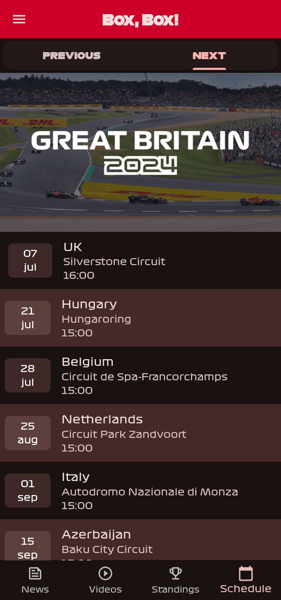

<p align="center"><a href="https://newpipe.net"></a></p> 
<h2 align="center"><b>Box, Box!</b></h2>
<h4 align="center">A new way to follow Formula 1.</h4>

[](https://github.com/BrightDV/BoxBox/blob/main/LICENSE)
[](https://github.com/BrightDV/BoxBox/issues)
[](https://github.com/BrightDV/BoxBox/network)
[](https://github.com/BrightDV/BoxBox/stargazers)
[](https://github.com/BrightDV/BoxBox/blob/main/LICENSE)


## Download

[](https://github.com/BrightDV/BoxBox/releases)

## Screenshots

[](fastlane/metadata/android/en-US/images/phoneScreenshots/0.png)
[](fastlane/metadata/android/en-US/images/phoneScreenshots/1.png)
[](fastlane/metadata/android/en-US/images/phoneScreenshots/2.png)
[](fastlane/metadata/android/en-US/images/phoneScreenshots/3.png)
[](fastlane/metadata/android/en-US/images/phoneScreenshots/4.png)
[](fastlane/metadata/android/en-US/images/phoneScreenshots/5.png)

## Features

- Box, Box! is free software, under GNU GPLv3 license.
- It contains no ads, no trackers or anything else.
- Get the latest stories of your favorite driver & his ranking, even without any Internet connection*. If you want, you can know where he is born and other personnal informations (not very useful though)...
- In-app reader for all the editorial articles with markdown!
- Enjoy the app even the night with its dark mode.
- Link to the highlights on YouTube of the qualifications and the race.
- Wait 'till the next race with its countdown
- Follow all the action on track with its integrated WebView (live leaderboard)

*You need to have Internet connection in order to refresh the data.

See the live demo [here. (Be aware that the live demo can be outdated)](https://brightdv.github.io)

## Services
| Screen  | Service          | Base URL |
| :---------------: |:---------------:| :---------------:|
| Home News  | Formula 1 API |  https://api.formula1.com |
| Standings (Q and R)  | Ergast API |  https://ergast.com/mrd |
| Standings (FP)  | Formula 1 Archives |  https://formula1.com/ |
| Schedule  |  Ergast API |  https://ergast.com/mrd |
| Live Timing |  Formula 1 |  https://formula1.com/ |

## Translation
For the moment, the app is only available in french, but it will be available in other languages, such as english.

## License
[](https://www.gnu.org/licenses/gpl-3.0.en.html)  

```
Box, Box! is Free Software: You can use, study, share, and improve it at
will. Specifically you can redistribute and/or modify it under the terms of the
[GNU General Public License](https://www.gnu.org/licenses/gpl.html) as
published by the Free Software Foundation, either version 3 of the License, or
(at your option) any later version.
```

## Note
I'm doing this app in my spare time, so I will appreciate feedbacks and PRs, but I can't do everyting ;).

Box, Box! is unofficial software and in no way associated with the Formula 1 group of companies.