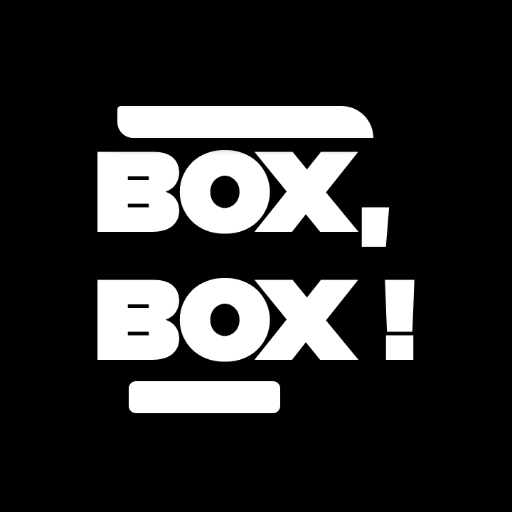

<p align="center"><a href="https://newpipe.net"></a></p> 
<h2 align="center"><b>Box, Box!</b></h2>
<h4 align="center">A new way to follow Formula 1.</h4>

## Screenshots
Coming soon...

## Features

- Box, Box! is free software, under GPL v3 lincense.
- It contains no ads, no trackers or anything else.
- Get the latest stories of your favorite driver & his ranking, event without any Internet connection*.
- In-app reader for all the editorial articles with markdown!
- Enjoy the app event the night with its dark mode.
- Link to the highlights on YouTube of the qualifications and the race.
- Wait 'till the next race with its countdown

*You need to have Internet connection in order to refresh the data.

## Services
| Screen  | Service          | Base URL |
| :---------------: |:---------------:| :---------------:|
| Home News  | Formula 1 API |  https://api.formula1.com |
| Standings  | Ergast API |  https://ergast.com/mrd |
| Schedule  |  Ergast API |  https://ergast.com/mrd |
| Live Timing (coming soon...)  |  Formula 1 Live Timing |  https://livetiming.formula1.com/ |

## Note
I'm doing this app in my spare time, so I will appreciate the feedbacks and the PRs, but I can't do everyting ;).

## License
[](https://www.gnu.org/licenses/gpl-3.0.en.html)  

```
Box, Box! is Free Software: You can use, study, share, and improve it at
will. Specifically you can redistribute and/or modify it under the terms of the
[GNU General Public License](https://www.gnu.org/licenses/gpl.html) as
published by the Free Software Foundation, either version 3 of the License, or
(at your option) any later version.```
