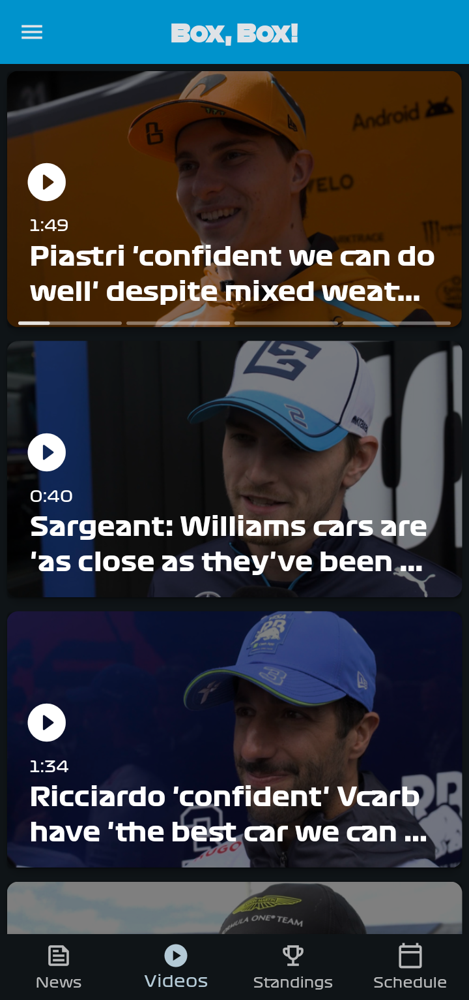
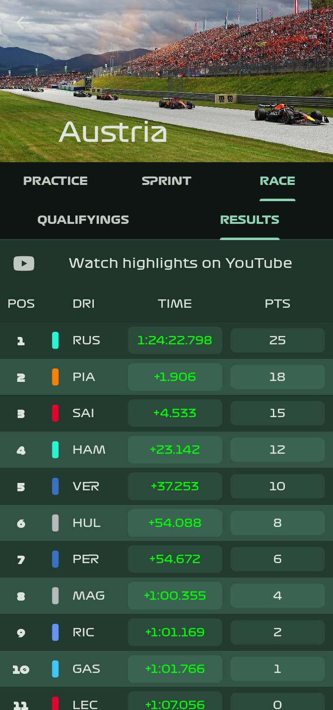

<p align="center"></a></p> 
<h2 align="center"><b>Box, Box!</b></h2>
<h4 align="center">Unofficial Android and Web app for Formula 1 and Formula E fans!</h4>

<div align="center">

[](https://github.com/BrightDV/BoxBox/releases/latest)
[](https://github.com/BrightDV/BoxBox/issues)
[](https://github.com/BrightDV/BoxBox/network)
[](https://github.com/BrightDV/BoxBox/stargazers)
[](https://github.com/BrightDV/BoxBox/blob/main/LICENSE)
[](https://github.com/BrightDV/BoxBox/releases)
[](https://codeberg.org/BrightDV/BoxBox)
[](https://hosted.weblate.org/engage/box-box/)

</div>

## Download

[](https://f-droid.org/packages/org.brightdv.boxbox/)
[](https://github.com/BrightDV/BoxBox/releases/latest)

## Screenshots

[](fastlane/metadata/android/en-US/images/phoneScreenshots/0.png)
[](fastlane/metadata/android/en-US/images/phoneScreenshots/1.png)
[](fastlane/metadata/android/en-US/images/phoneScreenshots/2.png)
[](fastlane/metadata/android/en-US/images/phoneScreenshots/3.png)
[](fastlane/metadata/android/en-US/images/phoneScreenshots/4.png)
[](fastlane/metadata/android/en-US/images/phoneScreenshots/5.png)
[](fastlane/metadata/android/en-US/images/phoneScreenshots/6.png)
[](fastlane/metadata/android/en-US/images/phoneScreenshots/7.png)
[](fastlane/metadata/android/en-US/images/phoneScreenshots/7.png)
[](fastlane/metadata/android/en-US/images/phoneScreenshots/7.png)

## Features

- Box, Box! is copylefted libre software, licensed GPLv3+.
- No ads, no trackers or anything else.
- Get the latest stories of your favorite driver and his ranking, even without any Internet connection\*. \
  If you want, you can know where he is born and other personal info (not very useful though)…
- In-app reader for all the editorial articles, with markdown!
- Watch all the latest videos with a dedicated tab and a swipe-up!
- Enjoy the app even at night with dark mode.
- Link to the highlights on YouTube of the qualifications and the race. (or even the sprint…)
- Wait till the next race with a countdown.
- Follow all the action on track with integrated WebView (live leaderboard).
- View the results of all the sessions (free practices, qualifying, sprints and races).
- Enjoy the race hub during a GP!
- Follow both Formula 1 and Formula E from the same app!

\*You need to have Internet connection in order to refresh the data…

## Instances

| Host     | URL                                |
| -------- | ---------------------------------- |
| Official | https://brightdv.github.io/boxbox/ |

## Services used

### Formula 1

|           Screen           |      Service       |                  URL                   |
| :------------------------: | :----------------: | :------------------------------------: |
|         Home News          |   Formula 1 API    |        https://api.formula1.com        |
|        Home Videos         |   Formula 1 API    |        https://api.formula1.com        |
|      Articles search       |      SearXNG       | [14 instances](lib/api/searx.dart#L26) |
|   Standings (Q, S and R)   |     Ergast API     |         https://ergast.com/mrd         |
| Standings (FP, Q, S and R) | Formula 1 Archives |          https://formula1.com          |
|          Schedule          |     Ergast API     |         https://ergast.com/mrd         |
|        Live Timing         |     Formula 1      |          https://formula1.com          |

### Formula E

Everything comes from the same API (Formula E API): https://api.formula-e.pulselive.com.

## Translation

Help translate _Box, Box!_ on [Hosted Weblate](https://hosted.weblate.org/projects/box-box/)

<a href="https://hosted.weblate.org/engage/box-box/">

</a>

Or, manually:

- Create a file named **[your language ISO code, like en, fr, etc].arb**
  These files are used by Flutter to provide you the translation.
- Translate [this file](lib/l10n/app_en.arb) to your language (only the text between the quotes).
- Finally, make a pull request or an issue and attach the code to it.

The app is currently available in:

- 🇬🇧 English
- 🇫🇷 French
- 🌐 Arabic, thanks to [@Music47ell](https://github.com/Music47ell)
- 🇧🇩 Bengali, thanks to [@Rafee-M](https://github.com/Rafee-M)
- 🇨🇳 Simplified Chinese, thanks to Ahoo Ng (五号电)
- 🇩🇪 German, thanks to [@RekZix](https://github.com/RekZix)
- 🇭🇺 Hungarian, thanks to [@d4f5409d](https://github.com/d4f5409d)
- 🇮🇹 Italian, thanks to [@atilluF](https://github.com/atilluF)
- 🇳🇴 Norwegian, thanks to [@comradekingu](https://github.com/comradekingu)
- 🇵🇹 Portuguese, thanks to [@Alexthegib](https://github.com/Alexthegib)
- 🇮🇳 Punjabi & Hindi, thanks to [@ShareASmile](https://github.com/ShareASmile)
- 🇪🇸 Spanish, thanks to [@inigochoa](https://github.com/inigochoa)
- 🌐 Swahili, thanks to [@leonardsangoroh](https://github.com/leonardsangoroh)
- 🇹🇷 Turkish, thanks to [@metezd](https://github.com/metezd)

and thanks to the other translators!

## Donation
If you like the app, and you want to support its development:

### Monero


Address: `48Yi7F3jDoQc5BsBQBaHnY6Y9hgP6oHev3AMNwd8QySsP52ZWZLhM3Hi4nccyq7wh81UEoXZvBSVmJ5sCLd9LLcXQPxqtxf`

### [Github Sponsors](https://github.com/sponsors/BrightDV)

## License

[](https://www.gnu.org/licenses/gpl-3.0.en.html)

```
Box, Box! is Free Software: You can use, study, share, and improve it at
will. Specifically you can redistribute and/or modify it under the terms of the
[GNU General Public License](https://www.gnu.org/licenses/gpl.html) as
published by the Free Software Foundation, either version 3 of the License, or
(at your option) any later version.
```

## Notes

I'm developing this app in my free time, so I appreciate feedback and welcome PRs!

(_Box, Box!_ is unofficial software and in no way associated with the Formula 1 group of companies nor the Formula E group of companies.)

Some interesting Formula 1 related projects:

- The amazing [Ergast API](https://ergast.com/mrd).
- [bacinger/f1-circuits](https://github.com/bacinger/f1-circuits): geo points for the map of each circuit.
- [theOehrly/Fast-F1](https://github.com/theOehrly/Fast-F1): client for live telemetry (upcoming) and stats, in Python.
- [slowlydev/f1-dash](https://github.com/slowlydev/f1-dash): feature-rich livetiming webview used by the app.
